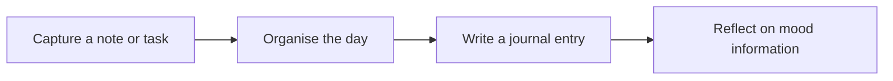

# DVS Note

**Notes, tasks and reflection in one academic application.**

A TU Dublin major group project by **Salem Elatrash, Daniel Aigbe and Adefolajuwon Adeniran**.

[Read the illustrated project overview](https://slooma951.github.io/portfolio/case-studies/dvs-note.html)

## Why we built it

Planning and reflection often happen in separate apps. DVS Note brings note-taking, to-do lists and journals together, with mood information for looking back on the day. The aim was to explore a mobile-focused productivity experience that also makes room for personal reflection.

## What the project contains

| Area | Purpose | Repository evidence |
| --- | --- | --- |
| Dashboard | A starting point for the application | Web dashboard page |
| Tasks | Capture and manage to-do items | To-do page and API route |
| Journals | Record and retrieve personal entries | Journal page and journal API routes |
| Mood information | Support reflection on recorded emotions | Mood statistics API route |
| Accounts | Register and access a personal workspace | Login page, account routes and session utilities |
| Mobile work | Explore a phone-based experience | Expo and Capacitor project material |

This is a conceptual user journey, not a claim that every archived target runs unchanged today.

## Technology

- **Web interface:** React, Next.js and Material UI.
- **Server routes:** JavaScript API routes within the web application.
- **Database:** MongoDB, confirmed in the web application's account connection utility.
- **Mobile tooling:** Expo / React Native and Capacitor appear in the repository.
- **Collaboration:** Git and GitHub.

The previous README described MySQL; the inspected account implementation uses MongoDB. This description follows the repository rather than the old template.

## Team and ownership of the work

| Team member | Credit |
| --- | --- |
| Salem Elatrash | Student developer, TU Dublin major group project |
| Daniel Aigbe | Student developer, TU Dublin major group project |
| Adefolajuwon Adeniran | Student developer, TU Dublin major group project |

The application is team work. Precise feature-level contributions have not been verified here, so this overview does not attribute the whole project or another person's work to any one member.

## Navigating the archive

The repository contains more than one project directory. Start with `DVS_Note/dvsnote` for the inspected Next.js pages and API routes, and `DVS_Note/dvsnote-expo` for mobile-related work. An additional `DVS Note` directory and root package files are part of the historical record.

The old README's generic `frontend/`, `backend/` and `database/` structure did not match this archive and has been removed from the description.

## What this demonstrates

Working as a student team, organising several related application areas, connecting interface and server responsibilities, and exploring a web and mobile experience. The archive also shows why a project needs accurate setup instructions and clear separation of platform-specific work.

## Status and limitations

**Archived academic project.** This documentation refresh does not claim a fresh build, a live hosted service, production security certification or publication in either app store.

Mood tracking is a reflection feature, not diagnosis, treatment or a clinical wellbeing service. Future ideas such as reminders and additional visualisations should be treated as proposals, not completed features.

Dependencies and environment requirements may have changed since the academic work. For reproduction, inspect the relevant package file and use isolated development settings; do not enter real personal data into an unreviewed historical build.

## Licence

See [LICENSE](LICENSE) for the repository's existing licence. This README refresh does not change that licence or the team attribution.

